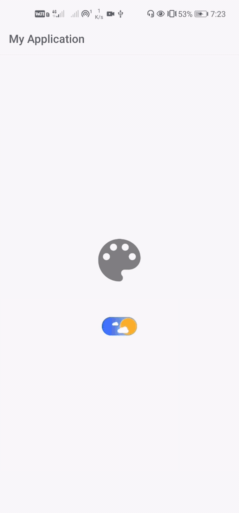

# Day Night Switch Button App
[](https://jitpack.io/#vimalcvs/DayNightSwitch)

A cute day night switch for android
Inspired from this gif :

</img>

### How to install
Add jitpack in your root build.gradle at the end of repositories:
```
	allprojects {
		repositories {
			...
			maven { url 'https://jitpack.io' }
		}
	}
```
Step 2. Add the dependency

```
	dependencies {
	        implementation 'com.github.vimalcvs:DayNightSwitch:1.0.0'
	}
```

### Usage

just add it to your xml layout file

```xml
    <com.vimalcvs.dnswitch.DayNightSwitch
        android:id="@+id/switch_item"
        android:layout_width="63dp"
        android:layout_height="33dp"
	android:gravity="center"/>
```

## Credits

This project was initiated by **TechnoVimal.in**. You can contribute to this project by submitting issues or/and by forking this repo and sending a pull request.


Follow us on:

[](https://www.facebook.com/vimalcvs)&nbsp;&nbsp;&nbsp;&nbsp;&nbsp;[](https://twitter.com/vimalvishwakar6)

Author: [Vimal K. Vishwakarma](https://github.com/vimal)

# License
```
Copyright (C) 2020 Code Mr. Vimal K. Vishwakarma

Licensed under the Apache License, Version 2.0 (the "License");
you may not use this file except in compliance with the License.
You may obtain a copy of the License at

http://www.apache.org/licenses/LICENSE-2.0

Unless required by applicable law or agreed to in writing, software
distributed under the License is distributed on an "AS IS" BASIS,
WITHOUT WARRANTIES OR CONDITIONS OF ANY KIND, either express or implied.
See the License for the specific language governing permissions and
limitations under the License.
```
